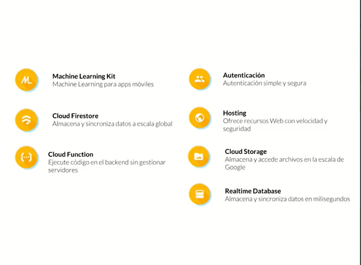

# Apuntes de Firebase Firestore con Kotlin

Firebase es una herramienta diseñada para desarrolladores móviles, la cual nos hace despreocuparnos completamente de la infraestructura, nos permite enfocarnos en el producto ofreciéndonos servicios que nos garantizan escalabilidad.

En este curso vamos a usar dos módulos de **Firebase, el modulo de Autenticación y el modulo de Cloud FireStore**.

## Modulo de Autenticación

Nos permite crear cuentas temporales las cuales pueden acceder a los datos que están protegidos con reglas de seguridad.


## Modulo de Cloud FireStore

Nos da una base de datos en tiempo real, sincronizada, no relacional y que es flexible a escalar a las diferentes configuraciones que queramos.


## Proyecto

En este caso construiremos una aplicación de criptomonedas la cual actualizara en tiempo real un dashboard.

## Firebase

La premisa que nos ofrece es **"aplicaciones rápidas sin preocuparte de infraestructura"**, esto se puede configurar de manera muy sencilla, en el curso vamos a utilizar estos módulos y con muy pocas lineas de código vamos a poder acceder y empezar a interactuar con **Firebase**.

Adicionalmente vas a crear mejores aplicaciones, te vas a enfocar mas en tu producto y esto va a hacer que tu productividad aumente no teniendo que preocuparte por toda la complejidad que conlleva configurar un backend y hacer que este escale.

## Otros módulos de Firebase



### Apps de Mayor Calidad

Las mediciones son muy importantes cuando desarrollas un producto de software para esto nos ofrecen diferentes herramientas para que podamos medir cual es la interacción que los usuarios tienen con nuestra aplicación. Para eso tenemos:

**Crashlytics** para medir todo tipo de fallos en las aplicaciones y priorizarlos.

**Monitor de Desempeño** el cual recibe todo los datos del desempeño de la aplicación.

**Test Lab** para probar nuestra aplicación en dispositivos reales lo cual es muy importante.


### Crece tu Negocio

Aquí queremos mirar todo el comportamiento de la aplicación y cómo lo podemos ajustar.


### Integrando Firebase al Proyecto

Para integrar Firebase al proyecto debemos ir a la pagina <https://firebase.google.com>, luego ir a la consola (el botón está en la esquina superior derecha), luego creamos un nuevo proyecto. En este caso el applicationId será **"com.platzi.android.firestore"**, en las configuraciones dejamos todo por defecto.

Luego elegimos un proyecto android, descargamos el archivo .json, lo arrastramos a la carpeta "app".

En el **build.gradle(Proyect)** agregamos en **dependencies**:

```gradle
classpath 'com.google.gms:google-services:4.3.8'
```

También debemos fijarnos que en **buildscript** esté google().

Luego en **build.gradle(Module)** agregamos en **dependencies**:

```gradle
// Import the Firebase BoM
implementation platform('com.google.firebase:firebase-bom:28.1.0')
// Add the dependency for the Firebase SDK for Google Analytics
implementation 'com.google.firebase:firebase-analytics-ktx'
```

Luego sincronizamos y listo, ya debería estar integrado Firebase a nuestro proyecto.

En caso de que te de un error del tipo:

```txt
Invoke-customs are only supported starting with android 0 --min-api 26
```

El cual fue mi caso, debes agregar en **build.gradle(Module)** en la sección **android{}** lo siguiente:

```gradle
compileOptions {
    sourceCompatibility JavaVersion.VERSION_1_8
    targetCompatibility JavaVersion.VERSION_1_8
}
```

Te dejo el hilo de StackOverflow [aquí](https://stackoverflow.com/questions/49891730/invoke-customs-are-only-supported-starting-with-android-0-min-api-26) por si quieres mas info sobre el error.

Y ahora si que si debería estar todo ok 😄.

### Autenticación Anónima Firebase

La autenticación anónima nos permite crear cuentas temporales las cuales pueden acceder a datos protegidos por reglas de seguridad.

Vamos a implementar la autenticación anónima de Firebase Authentication para crear cuentas temporales que pueden acceder a datos protegidos por reglas de seguridad.

Para importar la librería de Firebase Authentication debes copiar y pegar el link de autenticación en la sección de dependencias del archivo `build.gradle` y sincronizar tu proyecto para descargar la librería para utilizarla en nuestro proyecto:

```gradle
dependencies: {
    ...
    implementation 'com.google.firebase:firebase-core:16.0.7'
    implementation 'com.google.firebase:firebase-auth:16.1.0'
    ...
}
```

### Conociendo el modelo de datos de Cloud Firestore

Cloud Firestore es una base de datos no relacional muy flexible.

Tenemos un modelo de datos basado en dos tipos de objetos: Los **Documentos** (diccionarios de datos que podemos guardar y trabajar en forma de llaves y valores) y **Colecciones** (conjuntos de documentos).

Los documentos pueden ser sencillos o complejos, es decir, con llaves y valores y modelos de datos más avanzados; listas y objetos con más documentos en forma de llaves y valores o, incluso, más listas de documentos.

También podemos trabajar con **referencias** para acceder a nuestros documentos con "atajos" y realizar operaciones.

Nos permiten interactuar con una colección o documento especifico para realizar actualizaciones o lecturas

Ej:

```Kotlin
val bitcoinDocumentRef = db.collection("cryptos").document("bitcoin")

val bitcoinDocumentRef = db.document("cryptos/bitcoin")

val cryptosCollectionRef = db.collection("cryptos")
```

Recuerda que entre menos complejo es el modelo de tu base de datos mejor será su desempeño.