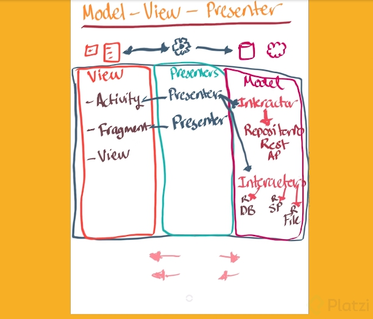
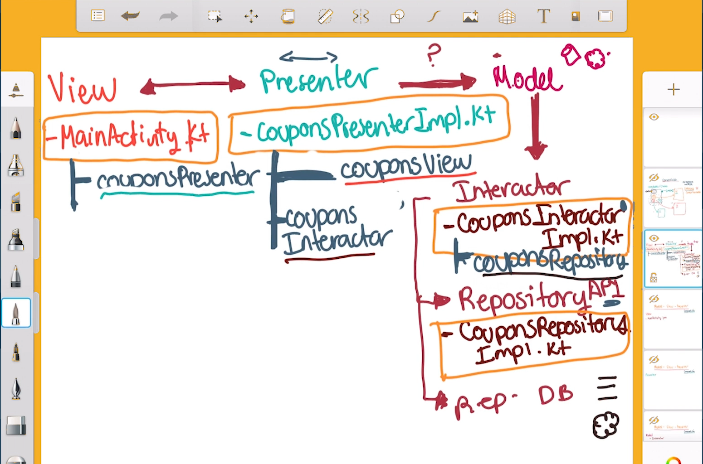
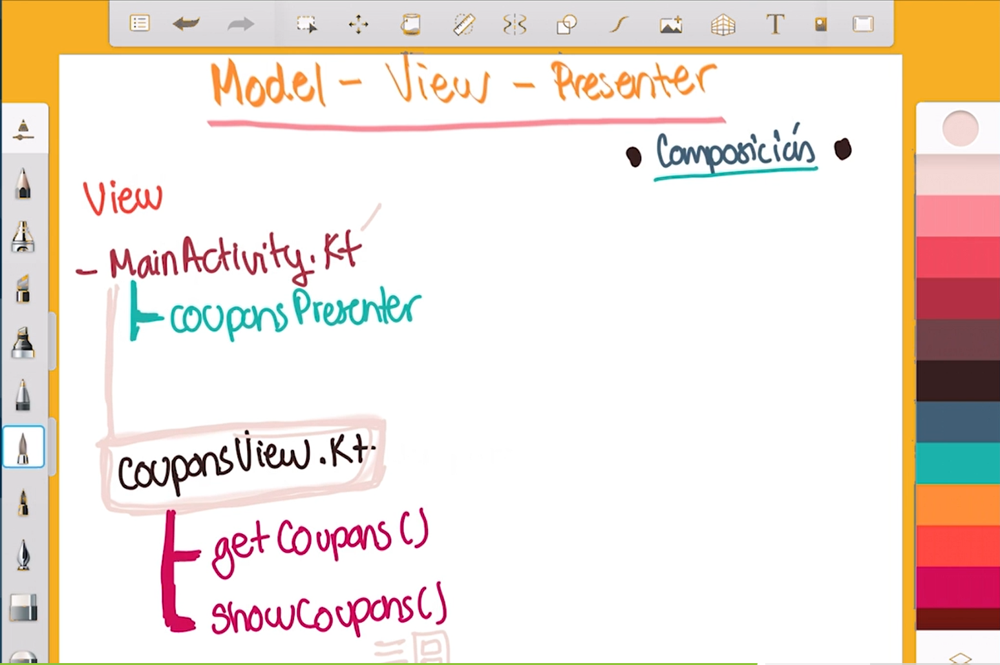
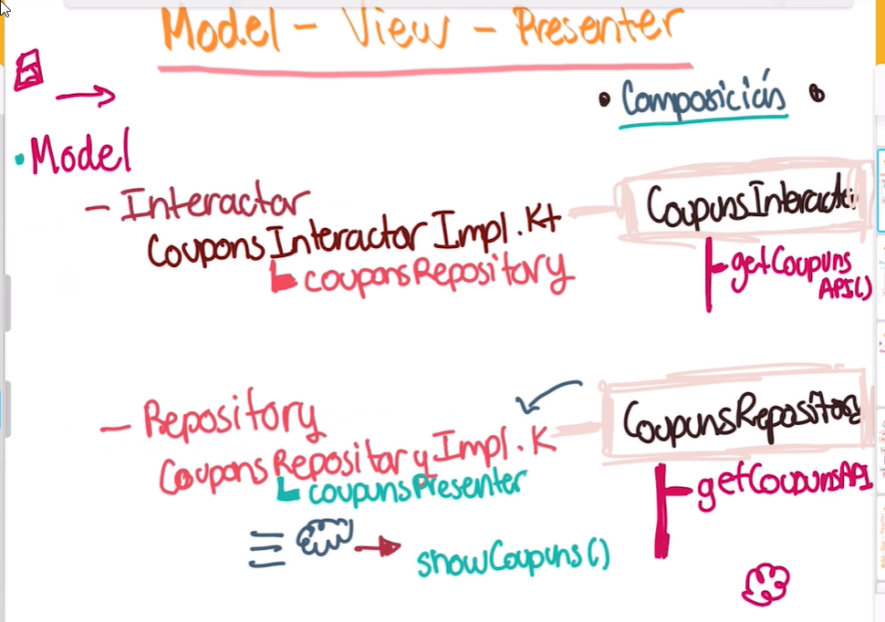

# Notas Arquitectura Android

Las aplicaciones móviles han dejado de ser simples y esto es porque proyectos más robustos nacen de la idea de **Mobile First**. Por lo general este tipo de proyectos grandes tienen la limitante del tiempo de desarrollo por lo que pueden convertirse en una pesadilla sino son bien diseñados.

**Deuda Técnica**: Es ese esfuerzo adicional causado por la elección de un desarrollo sencillo. Un desarrollo que no tiene una estructura pensada y analizada, no tiene una arquitectura adecuada al objetivo del proyecto.

Las aplicaciones móviles en general nos exigen mucho, los usuarios nos exigen que la aplicación sea:

- Rápida
- Fluida
- Segura
- Mantenible

## Patron de diseño vs. Arquitectura de Diseño

La **arquitectura** en general no solo podemos usarla en una aplicación móvil sino que deberíamos aplicarla a cualquier proyecto de software.

**Patrón de Diseño**: Un **patrón** es un modelo que sirve de muestra para sacar otra cosa igual. Los patrones de diseño son una solución a problemas comunes de código reutilizable.

- Organiza un componente o elemento de la aplicación

Algunos Patrones de diseño conocidos:

- Singleton
- Adapter
- Builder
- Factory

**Arquitectura de Diseño**: La **arquitectura** es el arte y técnica de diseñar, proyectar y construir. Una Arquitectura de Diseño proporciona la estructura, funcionamiento e interacción entre las partes del software.

Algunas Arquitecturas conocidas:

- **MVC** : Model-View-Controller
- **MVP** : Model-View-Presenter
- **MVVM** : Model-View-ViewModel

## ¿Qué es la Arquitectura de Diseño?

Una **arquitectura** nos proporciona una estructura, se va a encargar del buen funcionamiento y una buena interacción entre las partes del software.

**Modelo de capas (Layers Model)**. La arquitectura va a estar orquestando lo que sucede a nivel de aplicación. Ahora vamos a organizarlo en capas, módulos o partes del software:

- **UI o Presentación** : Encontraremos todo lo que tiene que ver con la interfaz de usuario: botones, imágenes, campos de texto y más.

- **Business Logic o Reglas de Negocio** : Encontraremos toda la lógica de lo que tiene que hacer la aplicación, los casos de uso de la aplicación: login, logout, registrar usuarios y más.

- **Data** : Veremos mucho sobre la persistencia y procesamiento de la información, la mayoría de las aplicaciones deben estar preparadas para soportarlo: leer una base de datos o traer datos de una API.

**Arquitecto de Software** : Va a analizar las necesidades, va a planear con anticipación, toman decisiones para evitar riesgos y tienen una amplia experiencia resolviendo problemas.

**El futuro tú** tendrá que reutilizar código creado por otro desarrollador, tocar código creado por ti de hace mucho tiempo, resolver bugs e implementar nuevos features.

En conclusión la Arquitectura de Diseño:

- Organiza el código para trabajar en equipo.
- Hace el código más intuitivo de leer y escribir.
- Permite mantener, testear e integrar nuevos features más rápido y fácil.

## SOLID: Single Responsability y Open/Closed Principles

**SOLID Principles**: La palabra **SOLID** es un acrónimo y cada una de sus letras representa un principio. Básicamente es un set de diseño que en general es de lo más popular a la hora de implementar una arquitectura en nuestro proyectos

- **S**ingle Responsability: Buscamos que una clase tenga una sola responsabilidad.
  
- **O**pen/Closed Principle: “Las entidades: clases, módulos, interfaces, etc. Deben estar abiertas por extensión pero cerradas para modificación”. Utilizar interfaces en este principio es de las mejores prácticas, buscamos que las funcionalidades de una entidad estén separadas y los parámetros o atributos también estén separados.

### SOLID: Liskov substitution, Interface segregation y Dependency Inversion principle

- **L**iskov Substitution: **Deberíamos poder usar una clase hija para sustituir a una clase padre sin obtener errores**.
  
Por ejemplo, cuando creamos una array, en Java sería:

```java
List<Integer> nums = new ArrayList<>();
```

ArrayList implementa List (una interfaz o padre), por lo tanto al llamar los metodos de list estaremos llamando a los metodos implementados en ArrayList.

- **I**nterface segregation: **Si una interfaz crece demasiado pierde su objetivo y viola el primer principio**.

```java
public interface OnClickListener {
    void onClick(View v);
    void onLongClick(View v);
    void onTouch(View, MotionEvent event); //Según el principio este metodo no deberia estar en la interface
}
```

Por ejemplo, una interfaz ‘Television’ no debería tener un método llamado ‘transmitirEn(Laptop)’.

- **D**ependency Inversion: **Depende de una abstracción, no de algo concreto**.

Por ejemplo, en vez enviar por parámetro un objeto específico (ej: new Corporacion(Ingeniero ing) ), debemos enviar un objeto más abstracto para que nuestra funcionalidad no este conectada a un tipo específico ya que esto puede causar problemas a la hora de arreglar bugs o añadir más features.

## Evolución de la Arquitectura en Android

**MVC (Model-View-Controller)**: Es donde teníamos todas las responsabilidades y todas las acciones de la aplicación en una sola clase, la clase activity (main.Activity).

**MVP (Model-View-Presenter)**: Separa las capas de modelo donde vamos a tener todas las conexiones. Después tenemos un presentador; es la capa donde mantiene la comunicación entre el modelo de datos y la user interface. Después esta arquitectura tuvo una evolución, donde se decidió que deberíamos seguir los principios de la arquitectura limpia, la cual nos dice que debemos exponer las entidades y que las entidades deben ser lo mas importante de la aplicación, mas allá de todas las capas que estén por debajo.

**MVVM (Model-View-ViewModel)**: en la vista tenemos activities y/o fragments, despues en la capa de view model vamos a tener clases que funcionen en un hilo adicional de la aplicación para eso vamos a tener clases como : AsyncTask, Rxjava y LiveData. Y por ultimo esta la capa de model que aqui vamos a tener toda la interacción con una base de datos para conectarla y hacer que los datos lleguen a la user interface.

**Android Jetpack**: Arquitectura de componentes(network resources).

## ¿Qué es la aquitectura Model View Controller (MVC)?

MVC fue la primera arquitectura con la cual empezó todo. Es importante conocerla en caso de que te encuentres con ella y sepas cómo migrar hacía una mejor arquitectura.

El **Model** tendrá la conexión a una base de datos o una API, es donde estan las entidades y los accesos a datos.

El **View** se va a componer de nuestra interfaz: botones y campos de texto, es donde estan los .xml como main_activity.xml.

El **Controller** será toda la lógica de negocio. Puede tener la lógica de lo que realizará un botón, es la clase que "infla" la vista el MainActivity.kt, poner la logica de negocio en esta clase no es recomendable.

Ambos elementos estarán definidos en un solo lugar.

## ¿Qué es la aquitectura Model View Presenter (MVP)?

Esta arquitectura resuelve varios detalles que se presentan cuando tienes una aplicación con **MVC**. No toda la responsabilidad debe caer en nuestro **MainActivity** porque esto podría ocasionar errores de fluidez haciéndola colapsar al haber un proceso pesado en el hilo principal de la aplicación.

**MVP** organiza mejor la distribución de archivos y define las responsabilidades de otra forma.

**Model** (Dos componentes): interactor y repositorio. El interactor decide que tipo de fuente de datos se va utilizar. Hay varios tipos de repositorios
uno puede ser una APIRest, BD, sharedPreferences.

**View**: Activitys, fragments, view. La vista no tiene conocimiento de los modelos.

**Presenter**:  Para cada activity o fragment, hay un presenter. Se encarga de recibir lo que la vista le solicite, primero pasando por el interactor.



## Composición en Clases

Nos permite extender funcionalidades hacia una clase en particular, de interfaz a clase y no de clase a clase.

Entidades/clases: contienen ciertos atributos y comportamientos.

En la composición se abstraen las funcionalidades a traves de una interfaz. En la clase se conservan las propiedades o atributos, en cambio las funcionalidades se declaran en la interfaz. De esta manera se puede reutilizar el comportamiento que ofrece la interfaz, en otras clases.

## Model View Presenter explicado

### Diagrama de Model View Presenter



### Estructura de View



### Estructura de Presenter


### Capa Model

