# Notas Bases Tecnicas de Android

Android es un sistema operativo desarrollado por Google para dispositivos moviles, esta basado en el kernel de linux y es **Open Source**.

## Retos de desarrollar apps en Android

Aspectos clave:

- Que la app esté disponible en variedad de dispositivos.
- Versionamiento de sistemas operativos; La cantidad de versiones que existen para android.
- Versión mínima aconsejada: Kitkat.
- Densidad del dispositivo: Interfaz de usuario según los tamaños de los dispositivos.
- Rendimiento: Uso de memoria y uso de CPU.
- Calidad: Las opciones disponibles para desarrollar en android para tener una mejor toma  de decisiones en base a nuestro conocimiento del sistema operativo. Independiente del lenguaje de programación.
- Workflow y Métricas de diseño: Establecidas y muy importantes. Hay que tener claras sus versiones, su evolución y el flujo de trabajo.
- Conocer qué lenguaje de programación hay a nuestro alcance, el entorno de desarrollo y las ventajas que trae utilizar un entorno oficial de desarrollo de aplicaciones IDE.
- Testing de aplicaciones, su lógica, su flujo.

## Tipos de dispositivos Android y Soporte

En Android existen diferentes tipos de dispositivos que tienen este Sistema Operativo:

- Notebooks
- Tablets
- Smartphones
- SmartWatch
- TV
- Autos.

Por lo tanto esto nos da un mundo de posibilidades en cuanto a tipos de pantallas, densidades y capacidades.

Además debemos considerar 3 puntos a la hora de desarrollar:

- Compatiblidad con Hardware.
- Compatibilidad con el Software (Sistema Operativo)
- Configuración de Pantallas.
  
Por último debemos especificar dos versiones de API para Android:

- minSdkVersion: Siendo esta la cual soportaremos como mínimo dando soporte de acá en adelante.
- targetSdkVersion: Siendo esta nuestro objetivo, es decir, que daremos features de nuestra aplicación considerando esta versión, por ejemplo si en Android Oreo nos dan la capacidad de agrupar notificaciones y Oreo es nuestra versión target nuestra App deberá tener un soporte para este tipo de notificaciones.

----------------------------------------------------

## COMPONENTES DE UNA APLICACION

----------------------------------------------------

## Activity

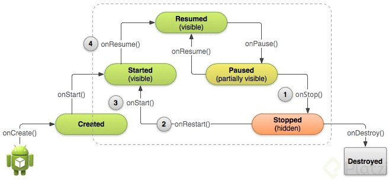

**onCreate(Bundle)**: Se llama en la creación de la actividad. Se utiliza para realizar todo tipo de inicializaciones, como la creación de la interfaz de usuario o la inicialización de estructuras de datos. Puede recibir información de estado de la actividad (en una instancia de la clase Bundle), por si se reanuda desde una actividad que ha sido destruida y vuelta a crear.

**onStart()**: Nos indica que la actividad está a punto de ser mostrada al usuario.

**onResume()**: Se llama cuando la actividad va a comenzar a interactuar con el usuario.

**onPause()**: Indica que la actividad está a punto de ser lanzada a segundo plano, normalmente porque otra actividad es lanzada.

**onStop()**: La actividad ya no va a ser visible para el usuario.

**onRestart()**: Indica que la actividad va a volver a ser representada después de haber pasado por onStop().

**onDestroy()**: Se llama antes de que la actividad sea totalmente destruida. Por ejemplo, cuando el usuario pulsa el botón de volver o cuando se llama al método finish().

Todas las pantallas de una aplicación son un activity. Esto quiere decir que si tenemos 10 pantallas en una aplicación tendremos 10 activities.

Las activities están formadas por dos partes: la lógica y la gráfica.

- La parte lógica es un archivo .java que es la clase que nos permite manipular, interactuar y escribir el código que queremos que esa pantalla realice.

- La parte gráfica es un archivo XML que tiene todos los componentes que vemos en la pantalla. Estos se declaran con etiquetas parecidas a las de HTML, es decir, que el diseño de una aplicación en Android es similar al de una pagina web.

## Fragments

Un Fragment representa un comportamiento o una parte de la interfaz de usuario en una Activity. Puedes combinar múltiples fragmentos en una sola actividad para crear una IU multipanel y volver a usar un fragmento en múltiples actividades. Puedes pensar en un fragmento como una sección modular de una actividad que tiene su ciclo de vida propio, recibe sus propios eventos de entrada y que puedes agregar o quitar mientras la actividad se esté ejecutando (algo así como una “subactividad” que puedes volver a usar en diferentes actividades).

Las aplicaciones tienen una barra inferior y superior que nos permiten estar navegando dentro los contenidos de la App estas barras funcionan a través de los Fragments que nos permiten trabajar con el contenido de las aplicaciones a modo de contenedores que contienen porciones de interfaz gráfica. Como resultado estaremos viendo cambios en nuestra pantalla de medio.

Los fragments también contienen un ciclo de vida que depende de activity.

Para que los fragments cumplan sus acciones correspondientes ya cuentan con metodos:

FragmentManager: Nos permiten manejar nuestros fragments

Transacciones: Son todas las acciones que se pueden realizar en el fragments

Commits: Para que sea reflejado el FragmentManager y las transacciones se tiene que enviar un commit (confirmar un conjunto de cambios)

## Intent

Cuándo estamos desarrollando una aplicación será muy común tener un flujo de “ventanas” es decir más de un Activity conectadas entre sí. Los **Intents** nos servirán para unir componentes de una aplicación, y podemos tener dos casos específiamente:

1. El que ya mencionamos, unir Activity’s dentro de la aplicación
2. Unir Activity’s que viven en diferentes aplicaciones

Los primeros se llamarán Explícitos

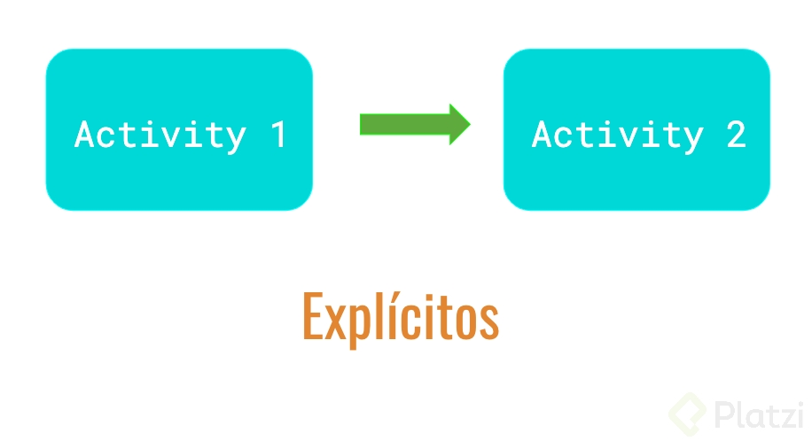

Los segundos Implícitos

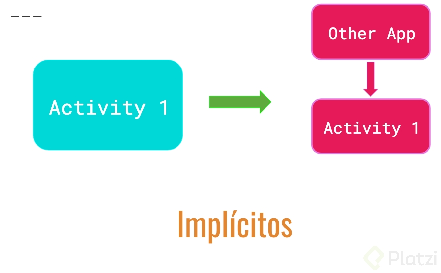

Además hablando de Flujos en una aplicación notarás que Android tiene un botón especial.

### El Botón de Back

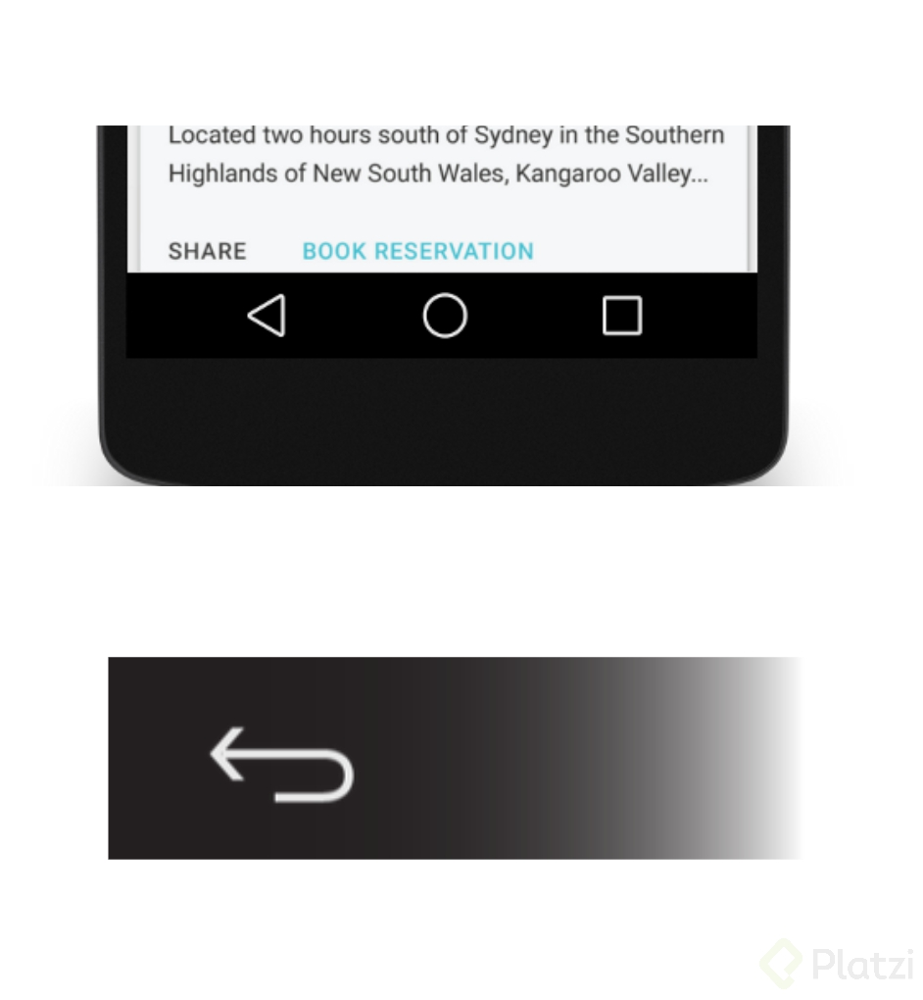

Este botón lo que hará será navegar en retroceso del flujo de la aplicación.

Tenemos otro que se introdujo en versiones recientes de Android:

### Botón up

Este está situado en la parte superior de la aplicación donde se encuentra el Toolbar y lo que hace es navegar en Jerarquía del flujo de la aplicación. Se llama Up porque lo que hace es regresar al nivel superior de donde provino.

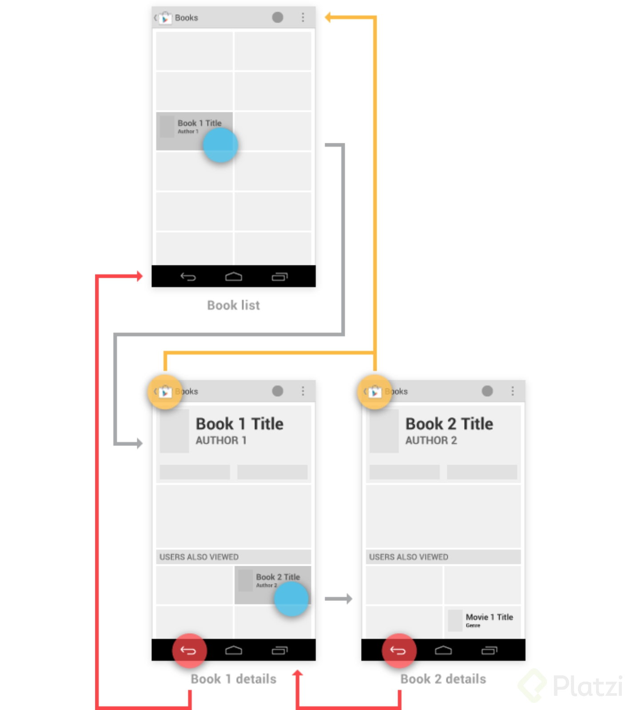

Esos flujos pueden ser controlados a tu conveniencia para unir con más Activity’s usando **Intent’s**.

## Services

Lo que hacen los servicios es ejecutar un trozo de codigo en background. Siempre que la aplicacion no esta enfrente se dice que la aplicacion esta en background, por lo tanto para ejecutar algo que esta en background utilizamos **services**. Los services se arrancan a partir de las actividades.

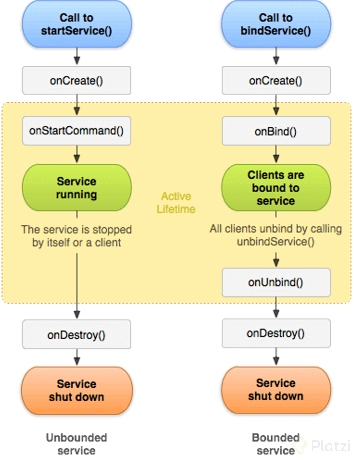

## Broadcast

Broadcast Receivers (Receptores de Transmisiones)

Siempre estan al pendiente de lo que pase en el Sistema Operativo

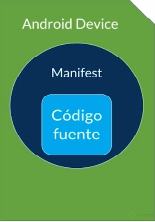

- Código Fuente: Como se compone una App

- Manifest: Se encargara de tener todo declarado respecto lo que pase en el dispositivo movil, es que el tiene contacto con el hardware

Estarán definidos aquí los Broadcast, porque estarán a alerta a lo que pase a las señales que envié el hardware para saber como operar, que aplicaciones utilizar, tomar decisiones.

## Asynctask

Es una clase ya prepara para trabajar con hilos (Son multiprocesos al mismo tiempo)


Una mala practica es que todas las tareas que procese la App se trabajen en el hilo principal ya que ocurrirán errores como que la aplicación se detenga .

Para eso se debe trabajar con un segundo hilo, que se estarán ejecutando los procesos en segundo plano en Background. Un ejemplo:

La playstore, el usuario puede descargar una App que se estará procesando en el Segundo Hilo, mientras el usuario sigue navegando por la aplicación.

## IDE Oficial de Android

Android Studio es el IDE oficial de Android, está basado totalmente en el entorno IntelliJ IDEA, es el más recomendado pues está diseñado totalmente para desarrollar aplicaciones móviles muy rápido.

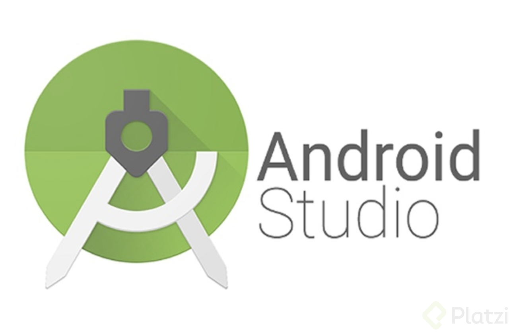

En mi experiencia he podido observar toda la evolución que este IDE ha tenido y cada cambio ha traído sus gratos beneficios. Desde que nació y trajo la sorpresa de tener como motor constructor de aplicaciones a Gradle, de quien sabrás más al respecto en las próximas clases.

Como ya te conté Android Studio tiene características exclusivas para móviles que te hacen mucho más sencillo construir y probar tus apps.

### Un Dispositivo Virtual (Emulador) para probar tus apps

----------------------------------------------------

Este es una simulación de un dispositivo real de Android, los hay en muchas de sus variables, teléfonos, tablets, smart watch, Android tv. En él podrás hacer la mayoría de las cosas que ejecutas en un dispositivo real. Siendo de gran ayuda para testear tus aplicaciones en dispositivos específicos.


Puedes ejecutar gestos, tomar fotografías, cambiar la dirección del teléfono, simular una llamada entrante así como también simular geolocalizaciones etc. Es muy flexible y muy rápido de habilitar.

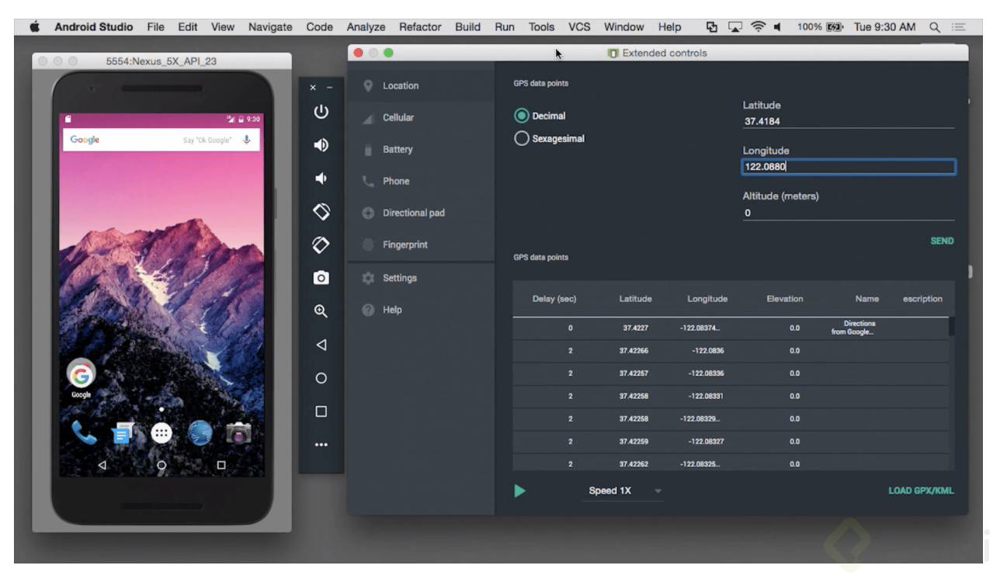

### Nos permite construir para todos los dispositivos

----------------------------------------------------

Android Studio cuenta con una distribución de archivos modular permitiéndonos construir una aplicación compatible para cada tipo de dispositivo manteniendo los proyectos separados haciendo personalizable el código separado para cada uno.

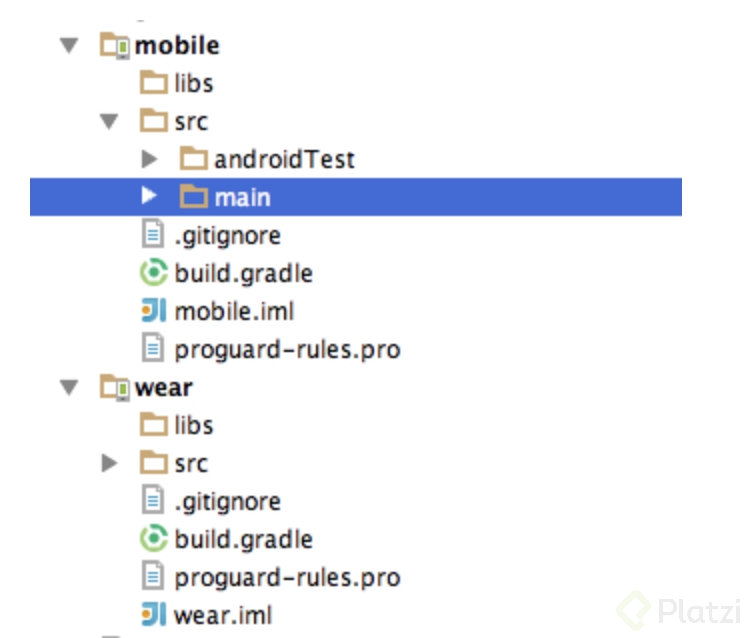

### Instant Run hará que correr tus apps sea muy rápido

----------------------------------------------------

La primera vez que corras una proyecto grande de Android notarás que tomará bastante tiempo, y esto es porque es una gran cantidad de archivos los que se necesitan para construir el ejecutable. Uno de los horrores para los desarrolladores era que este tiempo que tenían que esperar era cada vez que decidían correr la aplicación y esto es siempre una gran constante cuando estás desarrollando, siempre deseas ir viendo el resultado del código que programas.


Ahora con Instant Run será mucho más sencillo, la primera vez tomará tiempo compilar la aplicación para correrla pero después este IDE inteligente reconocerá solamente los cambios que ocurrieron y solamente esos será los que compile, reduciendo muy notablemente el tiempo.

### Github y Control de versiones integrado

----------------------------------------------------

Cuando trabajamos en equipo en proyectos de desarrollo usar git es obligatorio y una de las plataformas más conocidas es Github, Android Studio tiene una herramienta integrada para el manejo de versiones que únicamente tienes que activar.

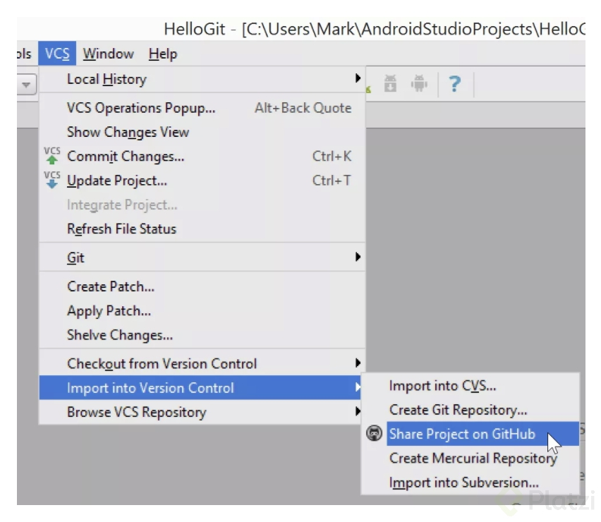

Es un entorno gráfico sencillo y muy accesible de usar, que nos ahorrará un par de minutos en teclear comandos. (La verdad es que amo los comandos, pero a muchos les agrada esta parte de Android Studio).

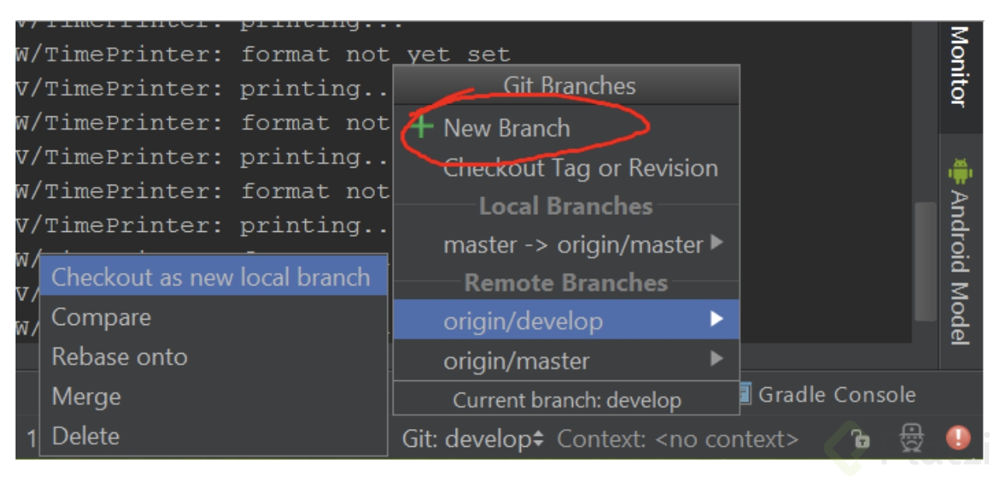

### Depuración Integrada

----------------------------------------------------

Android Studio tiene un sin fin de aditamentos que te ayudarán a construir aplicaciones mucho más rápido, desde el autocompletado de código, los accesos directos, así como la depuración integrada que vemos a continuación:


### Android Monitor / Android Profiler

----------------------------------------------------

Próximamente conocido como Android Profiler Es un monitor de rendimiento de apps que nos permite dar seguimiento del consumo de CPU, Batería y memoria de tu aplicación, nos permite analizar solicitudes de red, etc.

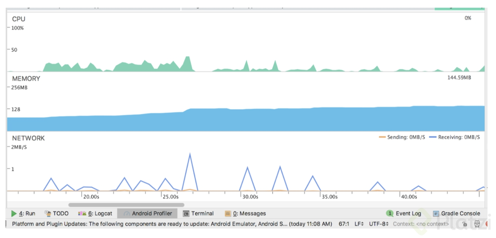

Como ves es muy conveniente usar Android Studio, pues está totalmente enfocado al desarrollo con Android, si desarrollarás apps móviles definitivamente deberás usar este IDE.

## Que es y como funciona Gradle

- Es utilizado por Android Studio para construir aplicaciones.
- Toma el código, las dependencias y librerías externas; las reune y construye un archivo ejecutable (APK: Application Package).
  
Realiza lo siguiente:

1. Integrar dependencias.
2. Crear un sistema de archivos.
3. Genera un ejecutable (APK).

Está basado en el lenguaje de programación **Groovy**, utiliza el Domain Specified Languaje (Lenguaje de dominio especificado) - JSON.

Tiene como archivo principal de configuración:
**build.gradle**

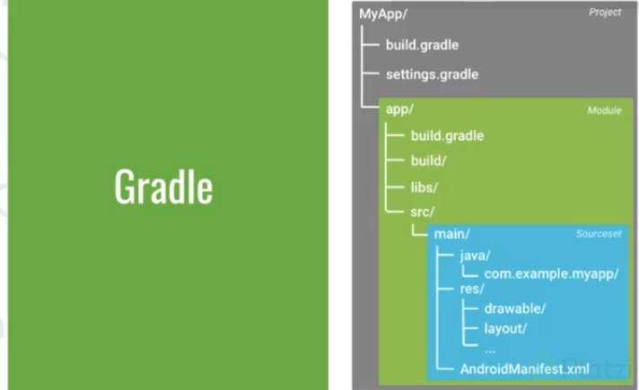

## Generacion de una APK en Android

APK es la extensión de los archivos ejecutables en Android su significado es **application package**, generarlo tiene un proceso interesante y se lleva a cabo bajo un proceso de compilación.

Te explicaré a pasos cómo es que se genera un archivo apk.

1. El compilador de Android convierte tu código fuente a un tipo de bytecode pero más eficiente para la máquina virtual de Android estos son archivos .dex.

2. Gradle empaqueta los archivos .dex y todos los recursos que usaste en la aplicación, imágenes, audios, videos, etc. generando un .apk

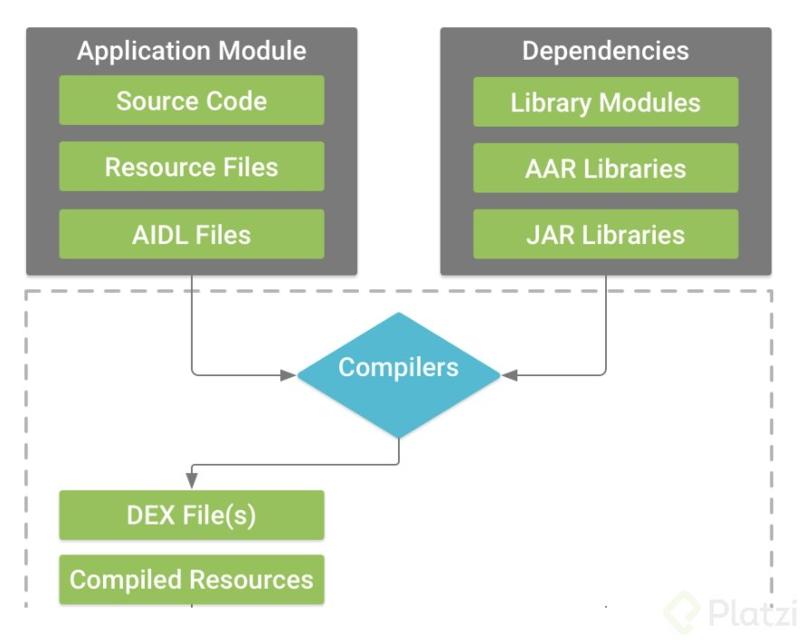

3. Gradle firma tu apk resultante usando una keystore.

4. Se puede generar un apk a modo de solo pruebas o general un apk listo para ser lanzado a la tienda, para cada caso será el tipo de keystore que debas usar.

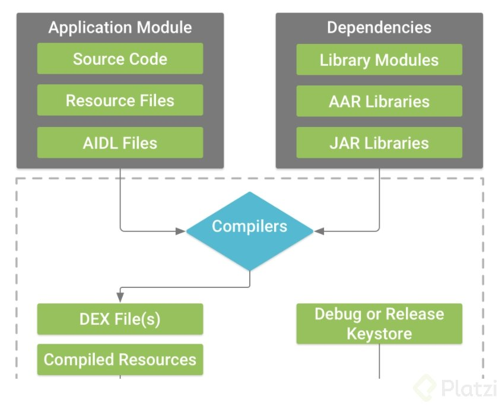

5. Como detalle notarás que al ejecutar el empaquetado intervendrá zipalign quien generará una versión optimizada del .apk para el teléfono.


## Google Play Services

Son los servicios que se pueden integrar a nuestra app como google maps, para poder trabajar en esto necesitamos el apk de **google play services** y la librería que estamos utilizando para integrar esto.

## APIS de Google Play Services

Lo que verás a continuación es una relación de todas los servicios de Google que tienes disponible para integrar a tus proyectos Android como librerías:

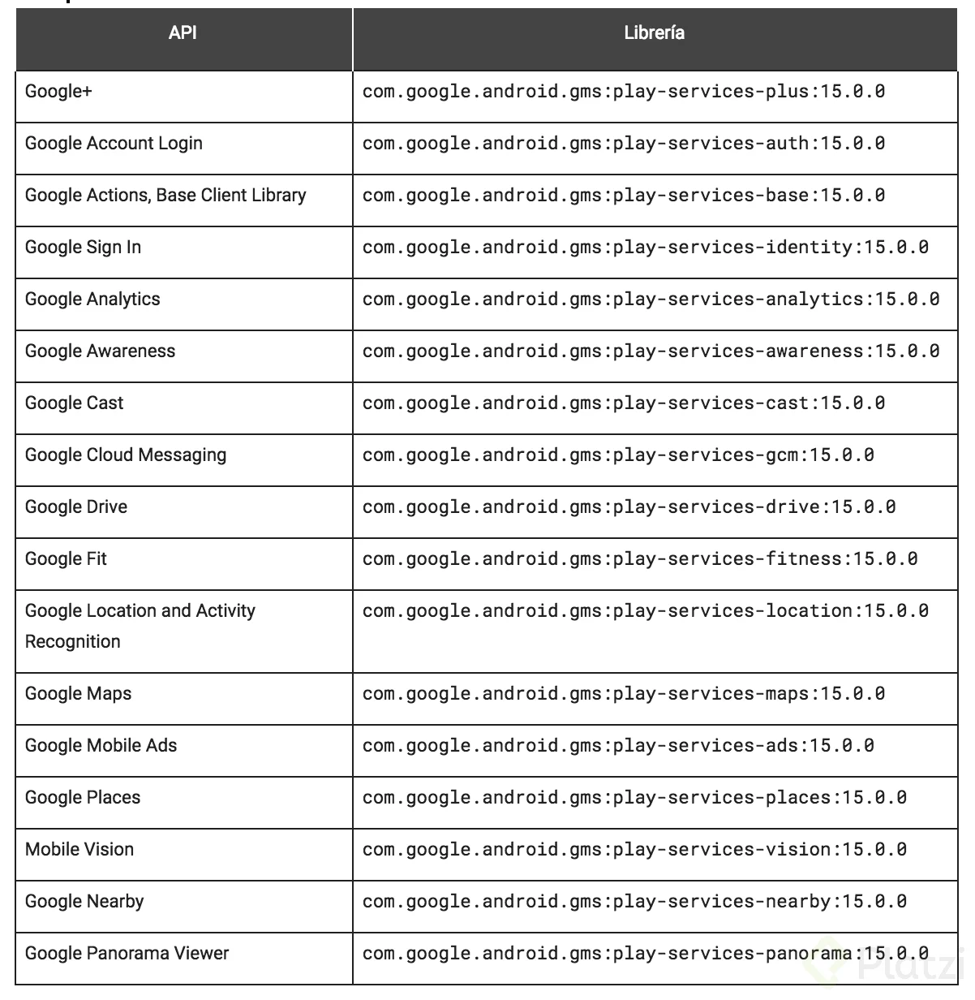


## Que es Material Design

Material Design son las métricas de diseño de aplicaciones fueron construidas por Google y traídas a Android a partir de la versión 5.0 Lollipop.

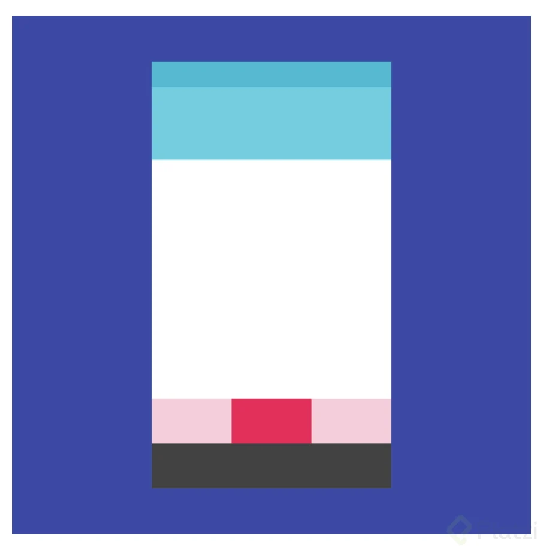

Específicamente lo que se introdujo es un tema nuevo, nuevos widgets y nuevas API’s de desarrollo.

Un tema nuevo que ofrece dos versiones obscuro y claro, que es dependiendo del tema que le quieras dar a tu proyecto.

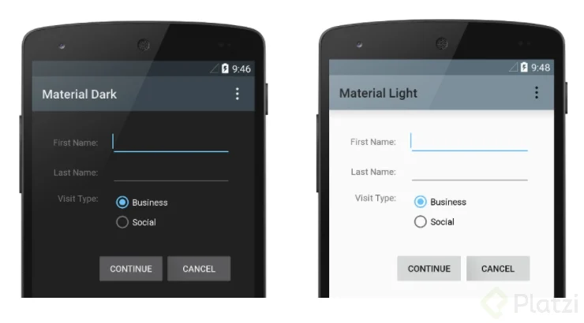

Sobre los widgets nuevos, entendamos widgets por elementos de la interfaz gráfica. Tenemos los siguientes:

- Tarjetas
- Listas de Tarjetas
- Una nueva Toolbar
- Bottom Bar
- Nuevos botones de acción
- Editores de texto con efectos
- Etc.

Material Design está basado en el manejo real y físico de materiales, como son especialmente hojas de papel, además que este, permite jugar con las sombras para crear efectos tridimensionales, la integración de animaciones es tan realista que se comportarán de acuerdo a las leyes de la física, por lo tanto para general esto último tenemos API’s de desarrollo que se integraron para trabajar con efectos y animaciones que hagan más interactivo el diseño.

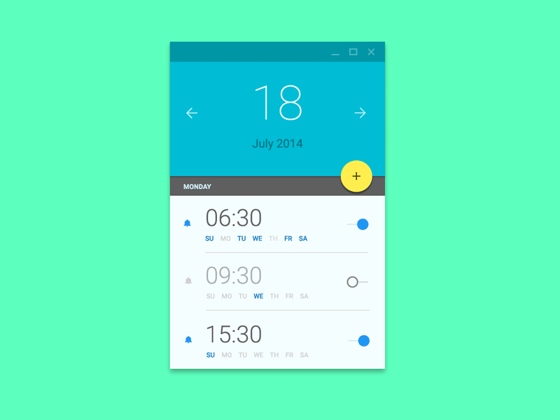

Si quieres conocer más sobre Material Design puedes ir al sitio oficial https://material.io/

Otro sitio muy interesante es https://dribbble.com/ el cual es muy conocido por ser la red social de diseñadores ahí encontrarás un gran catálogo de diseños de interfaces.

## Widgets de interfaz gráfica

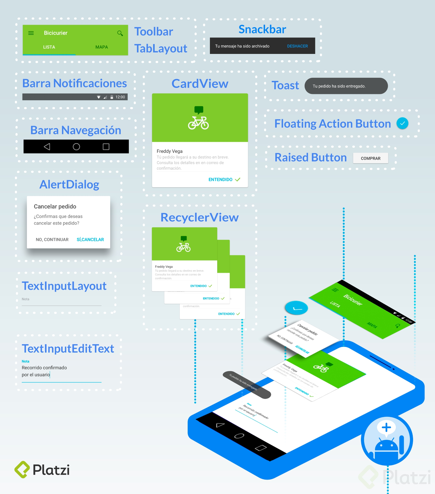

## Consideraciones para trabajar con Hardware en Android

El **hardware en android es uno de sus fuertes** y ésto es porque android nos permite tener **acceso a todo el hardware** del dispositivo, podemos tener acceso a la camará, cualquier dispositivo físico que se conecte por usb, el micrófono, bocina, botones físicos.

- Android nos provee de clases especiales desde la parte nativa para poder acceder a ellos, entonces consumirlos y utilizarlos y construir nuestra propias aplicaciones que manipulen el hardware de diferente tipo de teléfonos android.
  
- A partir de android marshmallow siempre tenemos que solicitar permisos de forma dinámica, en android ya se solicitaban permisos pero ahora lo hacemos cada vez que el usuario va ha utilizar esa especificación de hardware desde la aplicación.
  
- Podemos hacer aplicaciones que se sincronicen con otros dispositivos pero generalmente siempre tendremos que instalar en el desarrollo de la aplicación, tendremos que instalar la librería que nos permite tener la comunicación con ese hardware, por sí solo el proyecto no funcionará.

## Niveles de Almacenamiento y tipos

Existen diferentes tipos de almacenamiento donde pueden vivir los datos:

- Internos (Memoria del celular)
  
- Externos (Pudiendo ser una MicroSD o algún Webservice)
  
- **SharedPreference**: Es un modelo de datos primitivos utilizando el sistema de clave - valor.
Es un archivo con formato “.xml” y se encontrara dentro del dispositivo o donde se encuentra la app móvil, ya que este documento vive dentro del paquete de la Aplicación (en nuestro APK, es decir, el ejecutable de Android).

- **Bases de datos**: Las cuales se pueden almacenar dentro del a memoria interna del teléfono, y dentro del paquete de la app, o también en nuestro MicroSD (puede ser más vulnerable), por lo que es importante que este encriptada, para que sea más difícil de acceder a la información (WhatsApp).

- **Web Services**: Importante saber que utiliza internet por lo que no solo podemos tenerlo en nuestro celular a la información, si no que también puede ser almacenada en un servidor externo, obviamente necesitamos acceso a internet, por lo que hay que hacer las validaciones correspondientes con las librerías para saber si tiene acceso al mismo, así como también podemos controlar si esta conectado con redes de datos o WiFi, lo cual es importante ya que con datos si necesitamos subir muchos MBs podemos gastarle todo el plan de datos al usuario y no le será de mayor agrado.

## File y SharedPreferences

**file**

- Crea un archivo de cualquier tipo.
- Se trabaja con la clase file en Java/kotlin.
    - Ejemplo
  
```java
private File getTempFile(Context context, String url) {
	File file;
	try {
		String fileName = Uri.parse(url).getLastPathSegment();
		file = File.createTempFile(fileName, null, context.getCacheDir());
	} catch(IOException e) {}
	return file;
}
```

```xml
<manifest ...>
	<uses-permission android:name="android.permission.WRITE_EXTERNAL_STORAGE" />
	<uses-permission android:name="android.permission.READ_EXTERNAL_STORAGE" />
	...
</manifest>
```

----------------------------------------------------

**SharedPreferences**

- Utiliza una estructura .XML en forma de pares KEY:VALUE.

- El archivo se guarda en la carpeta shared_pref, dentro de la .apk.

- Se usan mucho para registrar preferencias de los usuarios como los colores, temas, scores, etc.
  
    - Como definirlas:

```java
SharedPreferences pref = getSharedPreferences("MisPreferencias",Context.MODE_PRIVATE);

SharedPreferences.Editor editor = pref.edit();
editor.putString("email","cajotafer@gmail.com");
editor.putString("nombre", "Carlos");
editor.commit();
```

## Content Providers Bases de Datos y Network

- **Bases de Datos**: Para trabajar con datos estructurados, complejos y relacionales. Se almacenan dentro del dispositivo, pero se puede almacenar externamente. Aunque, puede que la información se vea vulnerable. Por lo que, los datos se deben encriptar para proteger la información.
SQLite es un motor de base de datos que emplea Android. En la cual, las aplicaciones pueden guardar su información con las preferencias de los usuarios con data más extensa, a comparación de Shared Preferences.

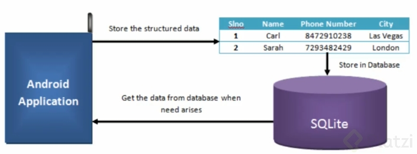

Los datos viven, mientras la aplicación viva. En caso, se desinstale la app, lo datos se perderán.

- **Content Provider (Proveedor de Contenido)**: Permite acceder a las bases de datos de otras aplicaciones que estén proveendo contenido. Ej. Consumir datos de los contactos del teléfono.
No requieren de conexión a internet.

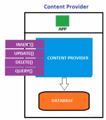

- **Web Service**: Los datos se pueden almacenar también en una base de datos que se encuentra en alguna parte de internet. Antes, es necesario identificar si el dispositivo puede acceder a internet. Además, podemos crear validaciones para limitar la cantidad de datos a consumir. Permite, trabajar con aplicaciones off-line.

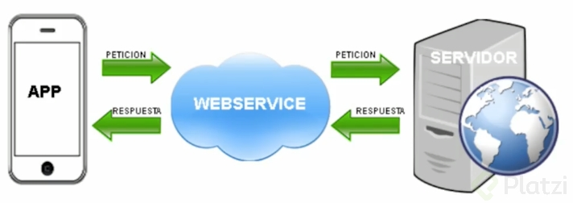

Los servidores deben estar siempre online para que los datos estén disponibles. Para ello, se puede usar plataformas Cloud. Por ej. Azure, Amazon Web Service, Firebase, etc.

## Tipos de Testing en Android y UI Test

Llevar un proceso de Testing en nuestras aplicaciones debe ser un proceso rigurosamente obligatorio, testear tus aplicaciones hará que tus usuarios reciban mayor calidad en el producto que les estás proporcionando.

Existen algunos tipos de pruebas que podemos ir ejecutando progresivamente a nuestras apps.

- Pruebas de unidad local
- Pruebas instrumentadas
- Pruebas de interfaz de usuario

Éstas se pueden ver ubicadas en la siguiente pirámide desde la base hasta la punta:


**Las pruebas de unidad local** son test pequeños que a medida que vas generando código lo vas probando rápidamente en tu computadora. También puedes programar código automatizado que ejecute una prueba.

**Las pruebas de instrumentación** principalmente las deberás ejecutar en el dispositivo y son básicamente pruebas donde integras los test anteriores a fin de que módulo a módulo la aplicación se vaya comportando adecuadamente, aquí testeamos que los módulos, servicios, etc. funcionen en conjunto.

**Las pruebas de interfaz de usuario** son totalmente enfocadas en el flujo de la interfaz de usuario, con esto nos aseguramos que las tareas que debe realizar el usuario en la aplicación funcionen como se espera.

Android Studio te ayudará a llevar los procesos de Testing que requieren tus apps, posee herramientas que nos ayudan a lograr esto.

## Tienda de Aplicaciones Android

Google Play Store es la tienda oficial de aplicaciones android, en ella encontrarás todo el catálogo de aplicaciones que puedes instalar en tu dispositivo.

Como desarrollador móvil te interesará entrar y dejar disponibles tus aplicaciones para que todo el mundo pueda conocer tu trabajo. El único requisito para lograr esto es obtener una cuenta de desarrollador de Google Play. Para ello deberás:

1. Registrarte en este enlace https://play.google.com/apps/publish/signup/
2. Aceptar el acuerdo de distribución para desarrolladores, lo puedes consultar aquí: https://play.google.com/about/developer-distribution-agreement.html
3. Pagar la única tarifa de registro de $25 USD al día de hoy.
4. Completar los datos de la cuenta.

Una vez hecho esto te dará acceso al Google Play Console (https://play.google.com/apps/publish/?account=7750131643547052717#AppListPlace) y estarás listo para publicar tus aplicaciones.

En la **Google Play Console** podrás administrar todas las fases de publicación de tu app, además de probar y recopilar datos antes de lanzar o incluso una vez que ya lo hiciste, puedes asignar precios y manejar informes de ventas, ver y administrar comentarios de tus usuarios, tener estadísticos y datos para entender y mejorar la estabilidad de tu producto. Todo esto ofrece la consola de Google Play entre muchas otras cosas más.

